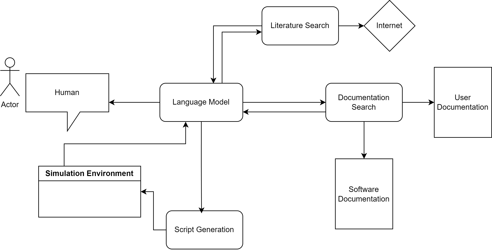

# ChemSimGuide: An AI Assistant for Engineering Simulation Setup using Gemini & LangGraph

> **🏆 Global Top 20 Finalist (out of 6,000+ teams) in the Google GenAI Capstone Project.**

[cite_start]ChemSimGuide is an intelligent, conversational AI assistant built to streamline the setup of complex chemical simulations. [cite: 1] [cite_start]By leveraging Google's Gemini API and the LangGraph framework, it acts as an interactive expert guide for the powerful, open-source Cantera software library. [cite: 1]

## 🎯 The Problem

[cite_start]Cantera is a versatile open-source suite for chemical kinetics, thermodynamics, and transport processes, but its power is matched by its complexity. [cite: 1] [cite_start]Domain experts like Chemical and Production Engineers often have deep process knowledge but may lack specific experience with Python libraries. [cite: 1] This creates a significant barrier, as they face challenges in:

* [cite_start]**Navigating Extensive Documentation:** Finding the right classes and methods is time-consuming. [cite: 1]
* [cite_start]**Translating Knowledge to Code:** Converting process models into the correct Cantera API calls and object structures is difficult. [cite: 1]
* [cite_start]**Understanding API Nuances:** The specific sequence of API calls is often not intuitive from a process perspective alone. [cite: 1]
* [cite_start]**Debugging Setup Errors:** Initial syntax or API usage errors can be frustrating and hinder progress. [cite: 1]

[cite_start]ChemSimGuide is designed to bridge this gap between domain expertise and library-specific coding knowledge. [cite: 1]

## ✨ Features

ChemSimGuide addresses these challenges by serving as an AI assistant that:

* [cite_start]**Translates Goals to Code:** Converts high-level simulation objectives into the necessary Cantera Python API calls. [cite: 1]
* [cite_start]**Deconstructs the Process:** Breaks down complex setups into a logical sequence of understandable steps. [cite: 1]
* [cite_start]**Provides Contextual Explanations:** Explains the purpose of each step and relevant Cantera concepts in accessible terms. [cite: 1]
* [cite_start]**Retrieves Specific Information (RAG):** Uses Retrieval Augmented Generation to pull precise examples and explanations from Cantera's official documentation. [cite: 1]
* [cite_start]**Generates Targeted Code Snippets:** Produces ready-to-use Cantera Python code for each step upon user request. [cite: 1]
* [cite_start]**Adapts Conversationally:** Handles follow-up questions and clarifications, allowing users to learn and refine their approach interactively. [cite: 1]

## 🏗️ Architecture

The agent is built as a stateful graph using LangGraph, orchestrating a cycle of conversation, reasoning, and tool use. [cite_start]The Language Model acts as the central reasoning hub, interacting with the user, a simulation environment, and a suite of tools for literature search, documentation search, and script generation. [cite: 2]

The workflow operates as follows:
1. [cite_start]User input is processed by a central `chatbot` node powered by a tool-aware Gemini model. [cite: 1]
2.  [cite_start]The LLM reasons about the conversation and decides on the next action: generate a textual response, ask a clarifying question, or call a tool. [cite: 1]
3.  [cite_start]Conditional logic routes the flow to the appropriate node, such as a RAG tool for documentation search (`search_cantera_docs`) or a dedicated code generation tool (`generate_cantera_code`). [cite: 1]
4.  [cite_start]The tool executes, and its output is returned to the `chatbot` node, updating the agent's state. [cite: 1]
5.  [cite_start]The cycle continues until the user's task is complete. [cite: 1]

## 🛠️ Tech Stack

* [cite_start]**Core AI:** Google Gemini API (for LLM reasoning and embeddings) [cite: 1]
* [cite_start]**Agent Framework:** LangGraph (for building stateful, graph-based agent applications) [cite: 1]
* [cite_start]**Knowledge Retrieval:** Retrieval Augmented Generation (RAG) [cite: 1]
* [cite_start]**Vector Store:** ChromaDB (for storing and searching documentation embeddings) [cite: 1]
* **Primary Language:** Python

### Prerequisites
- Python 3.9+
- An active Google Gemini API key

## Future Work
- [ ] **Expand Knowledge Base:** Integrate a wider range of Cantera examples, tutorials, and advanced literature.
- [ ] **Develop a Web Interface:** Create a user-friendly front-end using a framework like Streamlit or FastAPI.
- [ ] **Support for Other Libraries:** Extend the agent's architecture to provide guidance for other simulation libraries (e.g., OpenFOAM, COMSOL).

## Acknowledgments

- This project was developed as a submission for the Google GenAI Capstone project.
- The Cantera community for developing and maintaining an outstanding open-source simulation library.